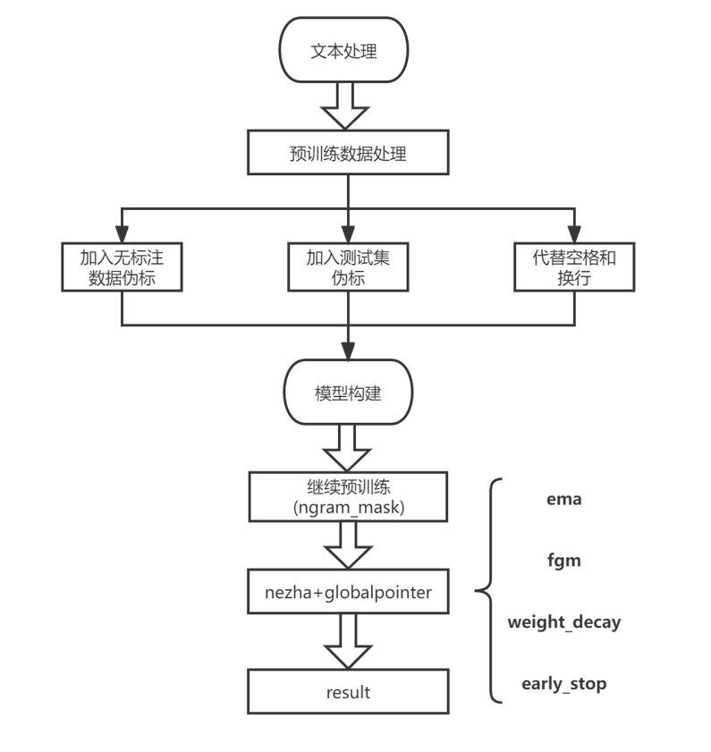

# 代码说明

## 环境配置
因为队伍里有2个服务器，单模伪标测试集时的环境依赖包是：requirements1.txt。其他训练、测试、预训练均使用的是requirements.txt的环境。  

**环境1：**
显卡型号：RTX-3090
python版本：3.7.11  
cuda版本：11.1.1  
cudnn版本：8.1.1  
torch：1.9.0+cu111
transformers：4.9.1  
等其他依赖包的版本信息在requirements.txt里，可通过如下命令进行安装配置：  
sh init.sh 

**环境2：**

等其他依赖包的版本信息在requirements1.txt里，可通过如下命令进行安装配置：  
sh init1.sh 

## 预训练模型
使用了my_nezha_cn_base预训练模型，可以通过如下命令对nezha-cn-base模型进行预训练得到：
python ./code/ITPT_nezha.py
我们分别训练了两个预训练模型： 

my_nezha_cn_base：通过100万无监督数据+4万训练集数据+1万a榜测试集数据(tmp_data/pretrain_data_105) 预训练得到。 epoch=5

my_nezha_cn_base55：通过前50万无监督数据+4万训练集数据+1万a榜测试集数据(tmp_data/pretrain_data_55) 预训练得到。 epoch=8

【注：对b榜测试集伪标时，我们使用的预训练模型是my_nezha_cn_base2，而在训练时（train.py）使用的预训练模型是my_nezha_cn_base。】

## 算法

### 整体思路介绍（必选）
- 1. 将数据转换成DataFrame的形式方便处理，传入Dataset,Dataloader封装数集，处理成bert模型输入所需形式。
- 2. 前向传播时，将数据按批次输入到GlobalPointer模型中进行训练，验证保存最优模型：best_model.bin。
- 3. 测试阶段，调用ark_nlp框架的预测函数对测试集进行预测

### 网络结构（必选）
以下为我们的模型的整体框架图：

### 损失函数（必选）
损失函数采用的是GlobalPointerCrossEntropy(在train.py里)，也就是多标签分类问题的交叉熵损失函数。

## 训练流程
对于训练的数据，我们采用了**4w全量的数据集+1w单模伪标测试集+3w五折模型伪标无监督数据**。  
**1w单模伪标测试集**，通过命令：python fold_pseudo_data(test).py产生（注：此处用的是requirements1.txt的依赖环境），文件存于tmp_data/pseudo_data_testb.txt  
**3w五折模型伪标无监督数据**，先通过命令：python train_kfold进行5折交叉验证保留5个模型，
然后通过命令：python kfold_pseudo_data(unlabeled).py对26无监督数据进行伪标，5个模型进行句子级投票，只有5个模型预测的句子完全一样才保留，
最后从26万条无监督数据集保留了3w左右条伪标数据。tmp_data/pseudo_data_3w.txt 

我们将以上3部分数据整合到一个txt里作为训练集，即tmp_data/train+testb单模伪标+unlabeld3w.txt

上面部分处理好的数据已存放在tmp_data目录下，无需重新跑，运行以下shell脚本即可。
使用如下shell命令执行train.sh即可  
sh train.sh

## 测试流程
使用如下shell命令执行test.sh即可运行测试程序，附带上参数：需要测试的数据
sh test.sh ./data/contest_data/preliminary_test_b/sample_per_line_preliminary_B.txt

## 其他注意事项
- 模型训练时，采样全量数据进行训练，验证采用全量数据后400项。
- 因为队伍里有2个服务器，单模伪标测试集时的环境依赖包是：requirements1.txt。其他训练、测试、预训练均使用的是requirements.txt的环境。